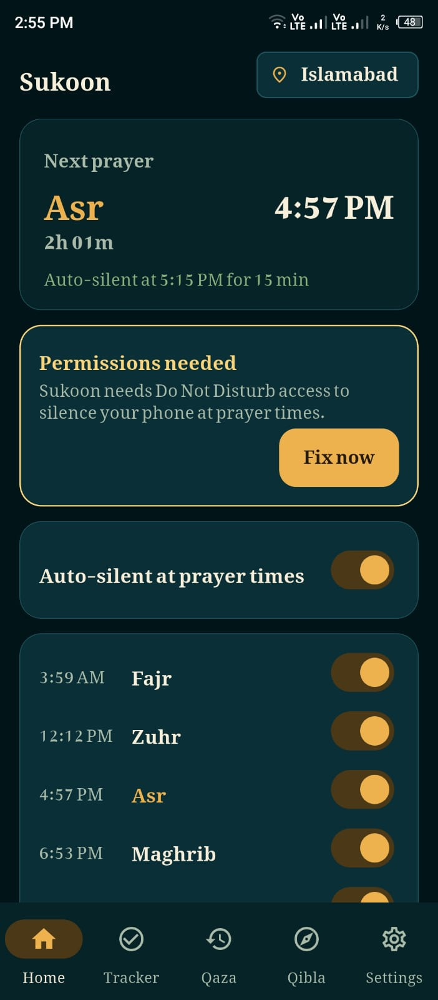
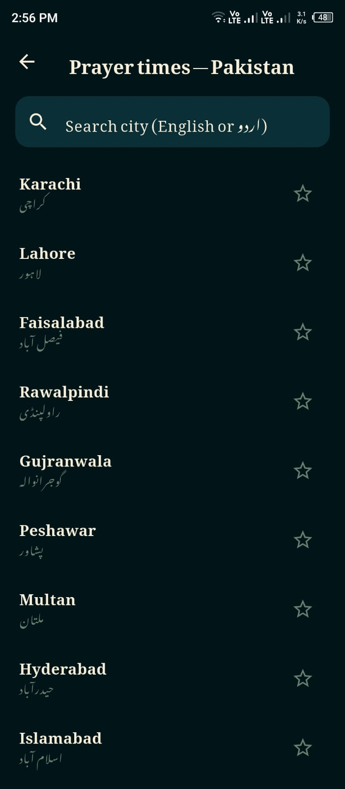
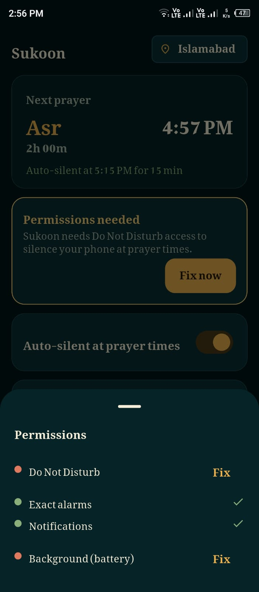
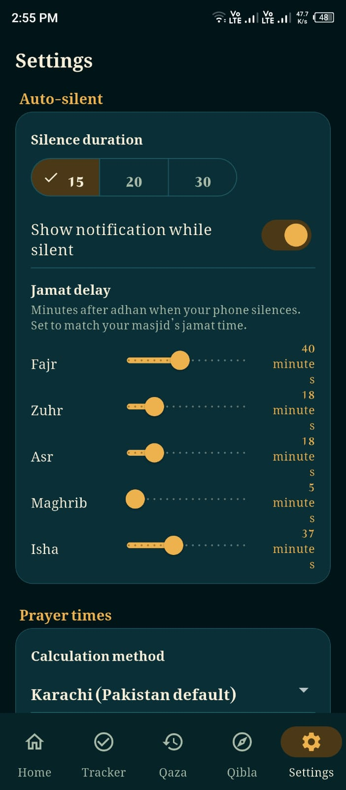
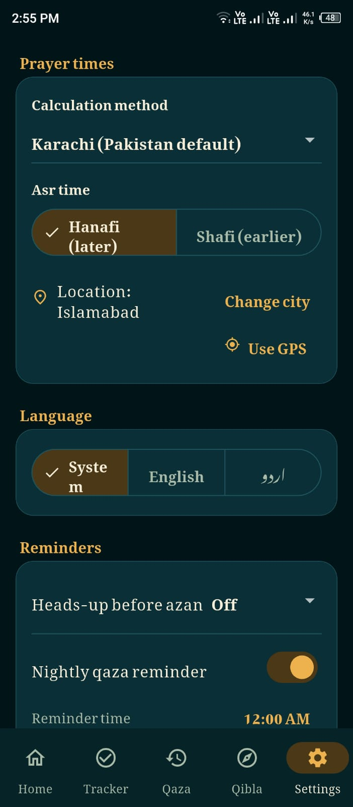
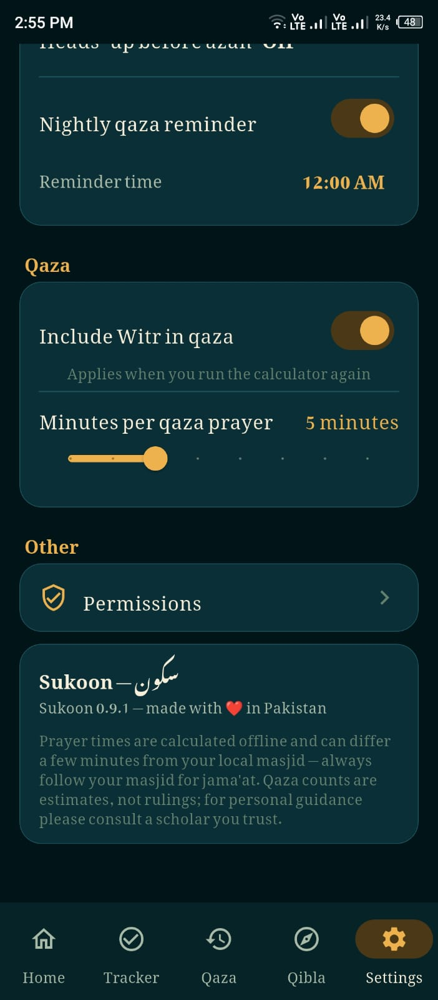
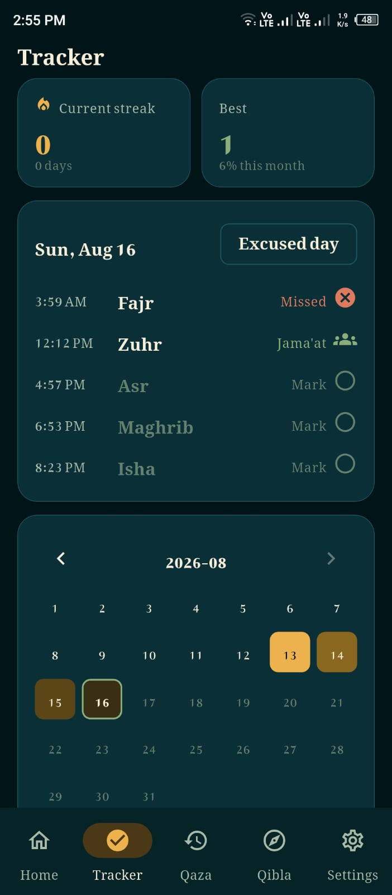
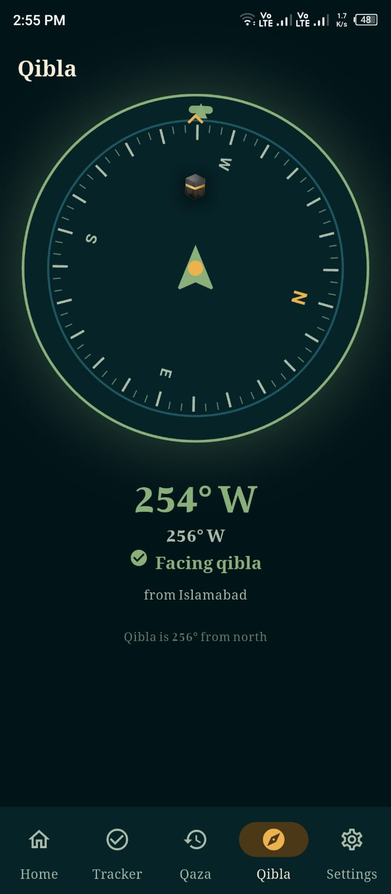

# Sukoon (سکون)

Sukoon is an Android Flutter application for Pakistani Muslims focused on private, offline-first daily prayer support.

## Overview

Sukoon brings essential daily workflows into one app:
1. Prayer-time based auto-silent mode with safe restore behavior.
2. Offline prayer times for Pakistani cities.
3. Namaz tracking with streak and heatmap views.
4. Qaza-e-umri estimation and repayment planning tools.
5. Qibla direction support.

## Key Features

1. Auto-Silent at Prayer Time
- Activates alarms-only DND level at prayer start.
- Restores the previous interruption state after 15, 20, or 30 minutes.
- Supports one-tap Masjid Mode.
- Continues working across reboot and timezone changes.

2. Offline Prayer Times
- Adhan-based prayer calculations.
- Karachi calculation method by default.
- Hanafi Asr setting by default.
- Pakistan-focused city dataset.

3. Namaz Tracker
- Daily prayer logging with jamaat and missed states.
- Streak tracking and heatmap visualization.
- Period mode support.

4. Qaza-e-Umri Planner
- Guided estimate flow with editable assumptions.
- Ledger and repayment planning tools.

5. Qibla Support
- Compass-based direction support.
- Mathematical bearing fallback.

6. Localization
- Full English and Urdu experience.
- RTL-aware Urdu interface.

## Technical Summary

Architecture follows clear separation of responsibilities:
- Flutter (Dart): UI, domain logic, local data, and feature modules.
- Android (Kotlin): exact alarms, DND handling, and background receivers.

Schedule synchronization is performed through MethodChannels, enabling exact-time native behavior even when the Flutter engine is not active.

## Scope and Policies

- Platform: Android.
- Data model: local-first; no backend required for core features.
- Monetization: no ads.
- Content policy: no Quran or Hadith text inside the app.

## Repository Layout

- lib: Flutter application source.
- android: native Android integration and receivers.
- assets: fonts, brand assets, and city data.
- docs: verification, release, and policy documentation.
- test: unit and logic tests.

## Development Notes

- Current implementation is under active verification and hardening.
- Detailed project status is maintained in docs/PROJECT_STATE.md.
- Verification waves are documented in docs/VERIFY_PLAN.md.
- Environment and setup guidance is documented in INSTALL.md.

## Screenshots

Sukoon provides a clean, intuitive interface for daily prayer management. Here's a quick visual tour of the key features:

### Home & Dashboard

  
   
  <em>Main dashboard showing today's prayer times and status</em>

### City Selection & Location

  
   
  <em>Offline prayer times for Pakistani cities</em>

### Permission Management

  
   
  <em>Required permissions for prayer time notifications</em>

### Settings Configuration

  
  
  
   
  <em>Three settings screens covering general, prayer, and notification preferences</em>

### Prayer Tracker

  
   
  <em>Daily namaz tracking with streak and heatmap views</em>

### Qibla Direction Finder

  
   
  <em>Compass-based Qibla direction with mathematical bearing fallback</em>

*All screenshots are taken in release mode on an Android device. The app supports both English and Urdu languages.*

